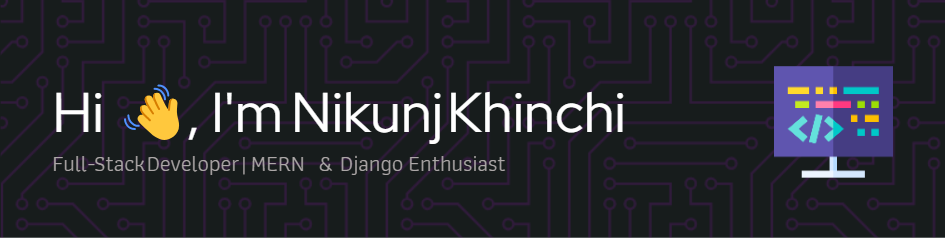

<!--
**Nikunj-Khinchi/Nikunj-Khinchi** is a ✨ _special_ ✨ repository because its `README.md` (this file) appears on your GitHub profile.

Here are some ideas to get you started:

- 🔭 I’m currently working on ...
- 🌱 I’m currently learning ...
- 👯 I’m looking to collaborate on ...
- 🤔 I’m looking for help with ...
- 💬 Ask me about ...
- 📫 How to reach me: ...
- 😄 Pronouns: ...
- ⚡ Fun fact: ...
-->

<!--
<h1 align="center">Hi 👋, I'm Nikunj Khinchi</h1>
<h4 align="center">Full-Stack Developer | MERN & Django Enthusiast</h4>
-->

# 💫 About Me :
-    👨🏻‍💻 Ask me about Full Stack Development
-    ♾️ I’m currently learning DevOps
-    👯 I’m looking to collaborate on backend technologies
-    🌟 Experience: Proficient in full-stack development using both the MERN stack (MongoDB, Express.js, React, and Node.js) and Django. Skilled in building scalable REST APIs, real-time applications, and frontend development using React and Redux. Experienced in database management with MongoDB, PostgreSQL, MySQL, Prisma, and Django ORM.
-    📃 Feel free to check out my <a href="https://drive.google.com/file/d/1GWz-yP3AnPB27MzznaJQcMmHH6jOn8iN/view?usp=drive_link" target="_blank">resume</a> for more details on my experience and skills.

# 🌐 Socials :

  

  
  

 

  

# 💻 Tech Stack :

  
  
  
  
  
  
  
  
  
  
  
  
  
  
  
  
  
  
  
  
  
  
  
  
  
  
  
  
  
  
  
  
  
  
  
  
  
  
  
  
  
  
  
  
  
  
  
  
  
  
  
  
  
  
  
  
  
  
  
  
  
  
  
  
  
  
  
  
  
  
  
  
  

# 📊 GitHub Stats :

  
  

